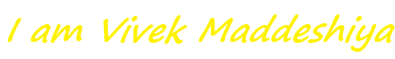

I am a self-taught Learner from India

- 🔭 I’m currently working on projects based on MERN stack.
- 📫 How to reach me:  
  

- 💬 Ask me about Anything <a href="https://github.com/vivekiet22/vivekiet22/issues">here</a>

<!--

### Hi ,I am Vivek Maddeshiya. 👋
**vivekiet22/vivekiet22** is a ✨ _special_ ✨ repository because its `README.md` (this file) appears on your GitHub profile.

Here are some ideas to get you started:

- 🔭 I’m currently working on projects based on MERN
- 🌱 I’m currently learning ...
- 👯 I’m looking to collaborate on ...
- 🤔 I’m looking for help with ...
- 💬 Ask me about ...
- 📫 How to reach me: 
- 😄 Pronouns: ...
- ⚡ Fun fact: I love to cook. My signature dish is homemade Sandwich and Maggie.

[]
-->

